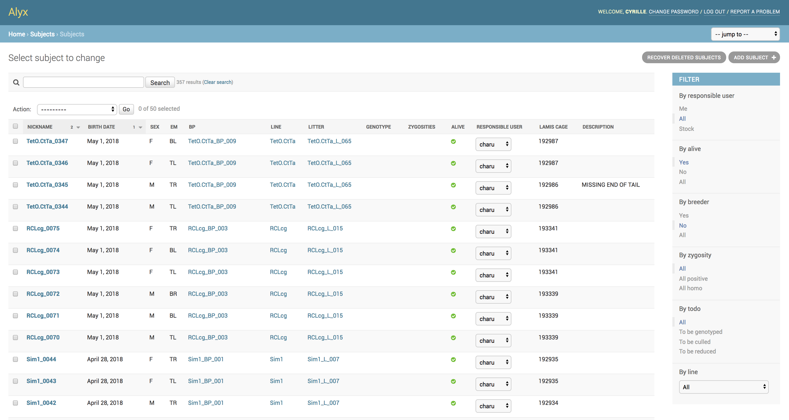

# alyx

[](https://travis-ci.org/cortex-lab/alyx)
[](https://travis-ci.org/cortex-lab/alyx)

Database for experimental neuroscience laboratories

Documentation: http://alyx.readthedocs.io



## Installation

Alyx has only been tested on Ubuntu (16.04 and 18.04). It could work on other systems but with no guarantees.

```
$ sudo apt-get update
$ sudo apt-get install python3-pip python3-dev libpq-dev postgresql postgresql-contrib virtualenv
$ sudo touch /var/log/alyx.log; sudo chmod 776 /var/log/alyx.log;
$ git clone https://github.com/cortex-lab/alyx.git
$ cd alyx
$ virtualenv alyxvenv --python=python3
$ source ./alyxvenv/bin/activate
$ pip install -r requirements.tx
$ python setup.py
Enter a database name [labdb]:
Enter a postgres username [labdbuser]:
Enter a postgres password:
...
$ python alyx/manage.py check
$ python alyx/manage.py runserver
```

Then, go to `http://localhost:8000/admin`, and log in with `admin:admin`. You can change your password and create users and user groups.

The `setup.py` script sets up postgres (it creates the database and postgres user), it sets up the `alyx/alyx/settings_secret.py` file with the postgres database connection information, it creates the Python virtual environment with the dependencies (including django), and it creates all the required SQL tables.


## Development

* Development happens on the **dev** branch
* alyx is sync with the **master** branch
* alyx-dev is sync with the **dev** branch
* From now on, only main alyx should git add and push the migration files

## Deployment process

1. Freeze alyx-dev
2. Full test on alyx-dev
3. On Monday morning, merge dev to master
4. Update alyx to master
5. Make SQL migrations
6. Migrate
7. Git add and push the new migration files from alyx
8. Full test on alyx:
```
$  python alyx/manage.py test -n
```
