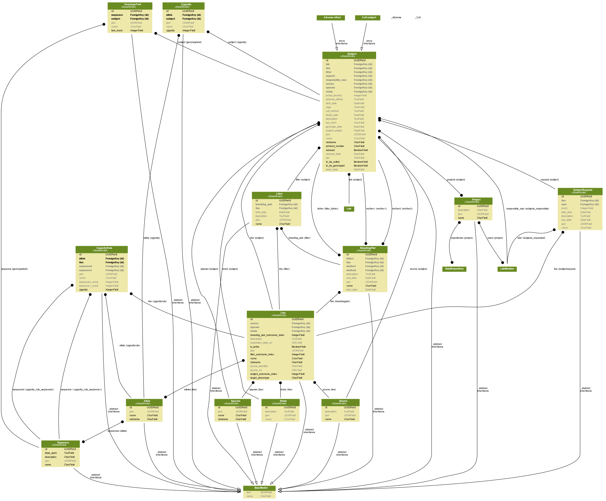
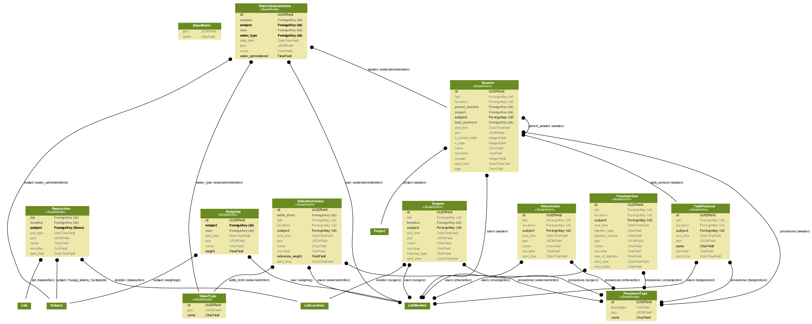
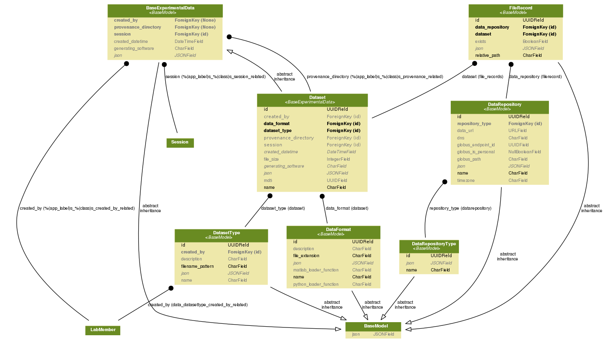
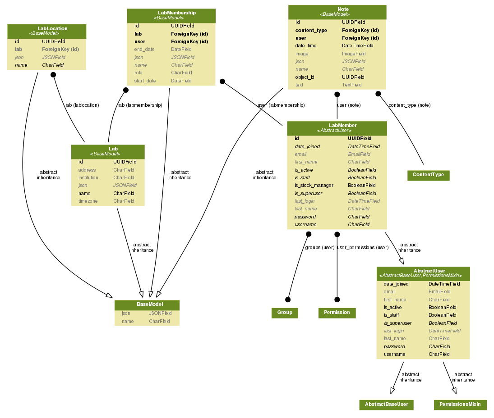

List of models
==================
These models generally correspond one-to-one with tables in the database.

Subjects
-------------------

.. automodule:: subjects.models
   :member-order: bysource
   :show-inheritance:
   :members:

Actions
-------------------

.. automodule:: actions.models
   :member-order: bysource
   :show-inheritance:
   :members:

Data
-------------------

.. automodule:: data.models
   :member-order: bysource
   :show-inheritance:
   :members:

Misc
---------------------

.. automodule:: misc.models
   :member-order: bysource
   :show-inheritance:
   :members:
